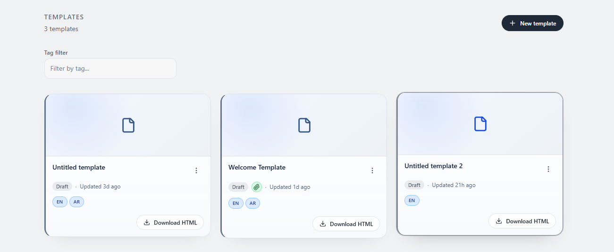
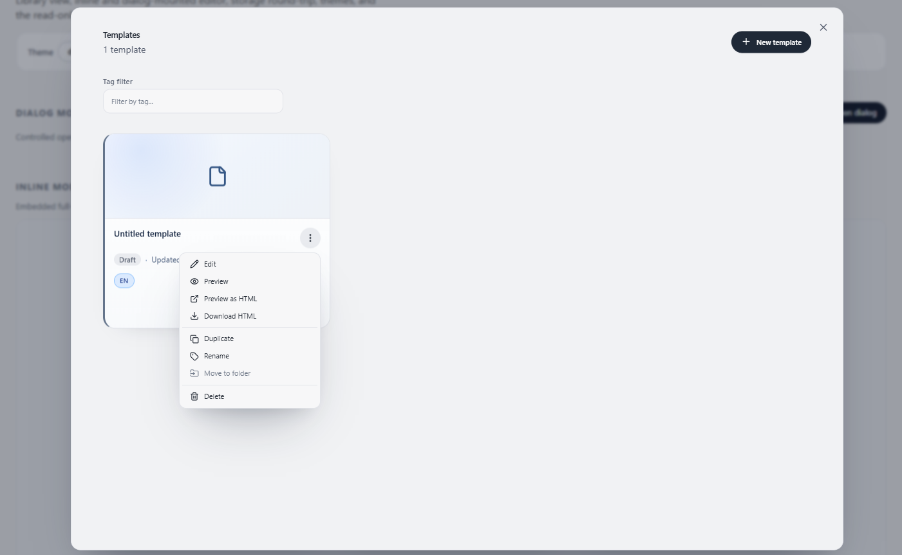
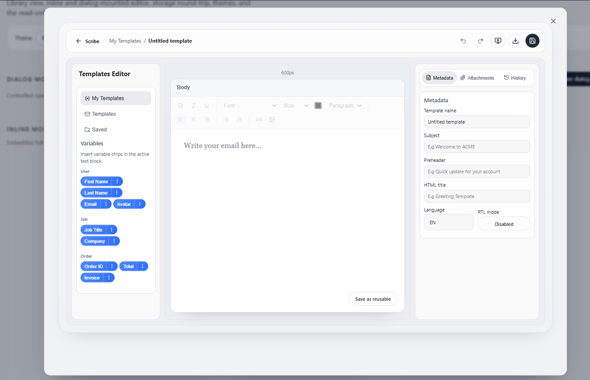
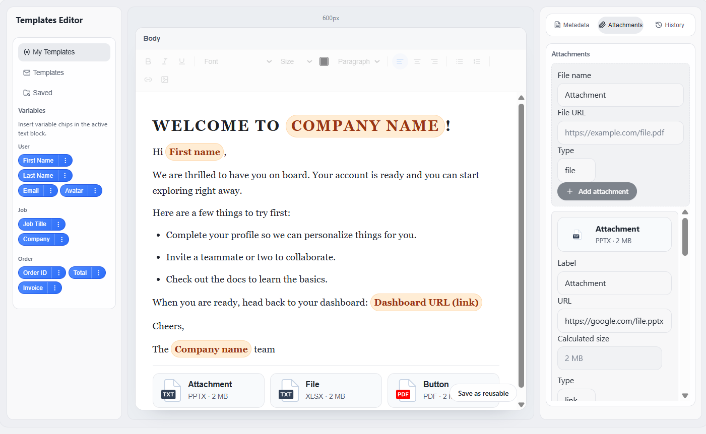
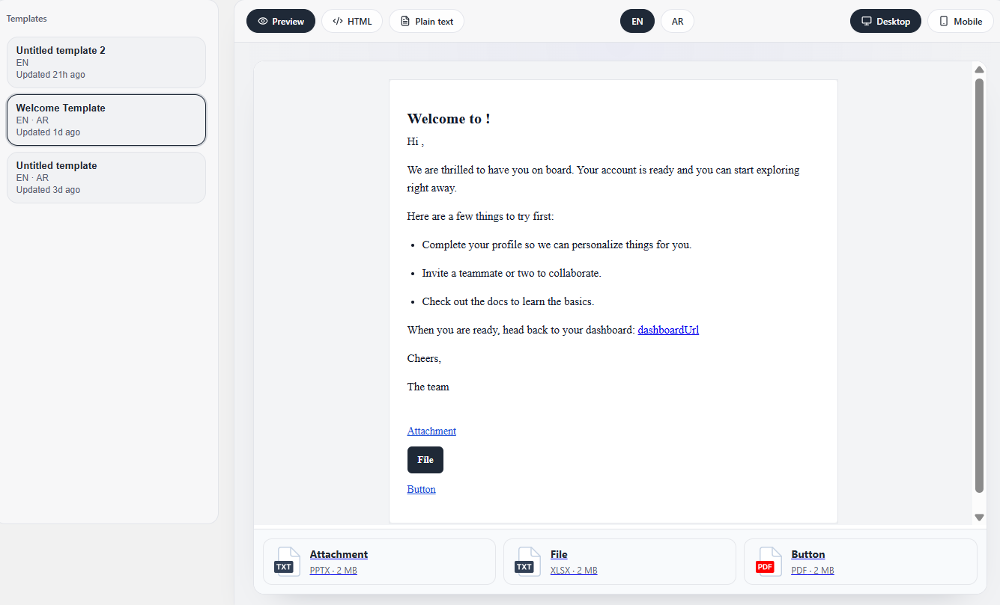
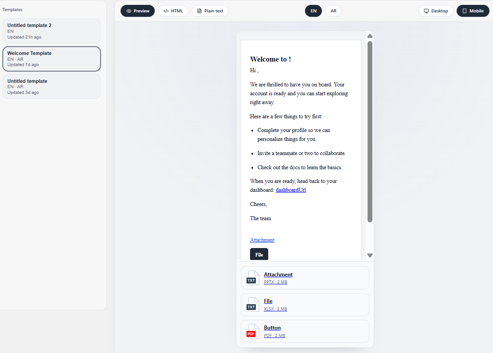
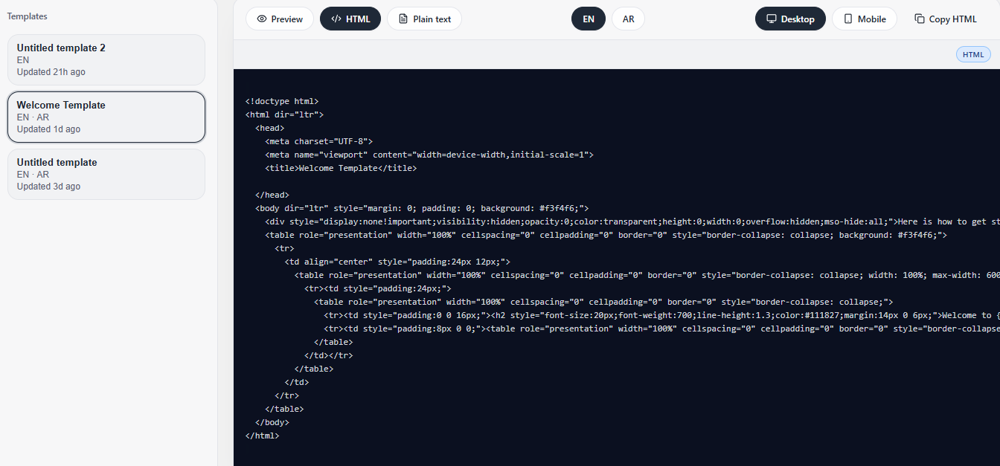
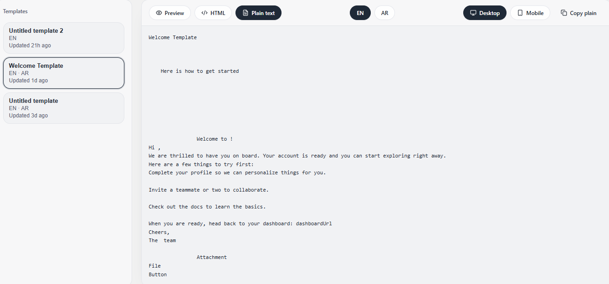

# RETM (React Email Templates Manager)

RETM is an embeddable React library for creating, managing, previewing, and exporting email templates with a visual editing workflow.

It ships with two main components:

- `EmailTemplatePanel`: full authoring + management UI (library, editor, metadata, attachments, export).
- `EmailTemplateViewer`: read-only browsing and preview experience for already created templates.

---

## What RETM does

- Helps teams build email templates visually instead of hand-writing full HTML from scratch.
- Supports variable schemas/tokens so templates can be hydrated with real runtime data.
- Exports production-ready HTML and plain output variants.
- Provides local storage mode and backend-connected mode via callbacks.
- Includes preview, versioning flows, status workflows, and attachment-aware rendering.

## What RETM does not do

- It is not a delivery provider (no SMTP/send-grid style sending engine).
- It is not a backend service by itself; backend persistence is host-app responsibility in `backend` mode.
- It is not a drag-and-drop website/page builder; it is focused on email template authoring.

---

## How RETM works

At runtime, RETM manages a structured `Template` object (language variants + metadata + editor JSON).  
The panel updates this structure through UI interactions, then uses export utilities to generate final HTML/plain outputs.

High-level flow:

1. Define your `VariableSchema`.
2. Author template in `EmailTemplatePanel`.
3. Save locally or through your backend adapter callbacks.
4. Export HTML (production/plain), with tokens resolved according to token format.
5. Render/read templates in `EmailTemplateViewer`.

---

## Compatibility

- React `>=18`
- React DOM `>=18`
- Works in React apps (Vite, CRA, custom setups) and Next.js client boundaries.
- Browser support: Chrome / Firefox / Edge 90+, Safari 14+, iOS 14+.

> `EmailTemplatePanel` and `EmailTemplateViewer` are interactive client components.  
> In Next.js App Router, mount them from a `"use client"` component.

---

## Requirements to run

### Consumer app

- Node.js 18+ recommended
- React 18+
- Include RETM stylesheet once:

```ts
import 'retm-library/styles.css'
```

### Local library development

```bash
# root deps
npm install

# playground deps
npm --prefix playground install

# run playground
npm run playground

# build library
npm run build

# typecheck
npm run typecheck
```

---

## Tools and stack RETM is built on

- React + TypeScript
- Vite (playground/dev build)
- TipTap (rich text editor internals)
- Radix UI primitives (menus/dialog foundations)
- Zustand (panel/store state management)
- CSS tokens (`--ec-*`) + scoped library styles

---

## Key features

- Visual template library + editor workflow
- Multi-language template variants
- Variable chips and token rendering
- Conditional/loop/content block support
- Metadata management (subject, preheader, etc.)
- Attachments with type and size handling
- HTML export + plain output
- Preview in panel + viewer
- Downloadable HTML per template
- Role/publish workflow hooks

---

## Install

```bash
npm install retm-library
```

Then:

```ts
import 'retm-library/styles.css'
```

---

## Quick start

```tsx
import { EmailTemplatePanel, type VariableSchema } from 'retm-library'
import 'retm-library/styles.css'

const variableSchema: VariableSchema = [
  {
    group: 'User',
    color: '#3b82f6',
    variables: [
      { key: 'user.firstName', label: 'First Name', type: 'string', required: true, sample: 'John' },
      { key: 'user.lastName', label: 'Last Name', type: 'string', required: true, sample: 'Doe' },
    ],
  },
]

export default function App() {
  return (
    <EmailTemplatePanel
      variableSchema={variableSchema}
      tokenFormat="handlebars"
      storageMode="local"
      theme="default"
      onExport={(payload) => console.log(payload)}
    />
  )
}
```

Viewer usage:

```tsx
import { EmailTemplateViewer } from 'retm-library'

<EmailTemplateViewer
  storageMode="backend"
  onLoad={() => fetch('/api/templates?status=published').then((r) => r.json())}
  defaultView="grid"
  codeView={{ enabled: true, showLineNumbers: true, copyButton: true }}
/>
```

---

## Visual walkthrough

This walkthrough uses real screenshots from the `screens` folder so users can quickly understand the full RETM flow.

### 1) Open the library and saved templates

The user starts in the templates library, where saved cards can be reviewed and selected.



### 2) Use card actions (preview, rename, duplicate, download HTML, delete)

Each saved template has an action menu for lifecycle and export operations.



### 3) Enter the editor panel

The editor panel is the main authoring surface for metadata, variables, templates, and attachments.



### 4) Build the email on canvas

Users compose content blocks and prepare complete template layout directly in the canvas.



### 5) Preview as real email output

Viewer preview mode renders the generated email output for final QA.



### 6) Validate responsive/mobile rendering

Viewer supports mobile viewport testing for layout sanity checks before publishing.



### 7) Inspect exported HTML code

Users can open and verify the generated HTML source.



### 8) Inspect plain-text version

Users can review the plain-text fallback output used for email clients that do not render HTML.



---

## Exported files and output shape

RETM export pipeline produces HTML output from template metadata + editor JSON + your variable schema context.

Typical export payload includes:

- `html`: generated markup
- `mode`: `production` or `plain`
- template identifiers and metadata context

The generated HTML is email-oriented and includes rendered attachments and tokenized/expanded sections depending on mode/context.

---

## Customizing exported data

You can customize export behavior at multiple levels:

- `tokenFormat` (e.g. handlebars-compatible tokens)
- `customTokenFormat` for custom wrappers
- `sampleData` for plain/hydrated previews
- `onExport` callback for post-processing before delivery/storage

### Example: override token syntax

```tsx
<EmailTemplatePanel
  tokenFormat="custom"
  customTokenFormat={{ open: '[[', close: ']]' }}
  onExport={(payload) => {
    // persist payload.html, run sanitizer, upload, etc.
  }}
/>
```

### Example: inject external runtime data for hydrated preview/export

```tsx
<EmailTemplatePanel
  sampleData={{
    user: { firstName: 'Maya', tier: 'pro' },
    invoice: { number: 'INV-1048', total: '$329.00' },
  }}
/>
```

---

## Using external custom data and backend integration

Use `storageMode="backend"` and provide callbacks that map to your API.

Typical integration pattern:

```tsx
<EmailTemplatePanel
  storageMode="backend"
  onLoad={() => fetch('/api/templates').then((r) => r.json())}
  onSave={(payload) =>
    fetch('/api/templates/save', {
      method: 'POST',
      headers: { 'content-type': 'application/json' },
      body: JSON.stringify(payload),
    })
  }
  onPublish={(payload) =>
    fetch('/api/templates/publish', {
      method: 'POST',
      headers: { 'content-type': 'application/json' },
      body: JSON.stringify(payload),
    })
  }
/>
```

---

## How deep can layout/UI be customized?

Very deep, through:

- Theme prop + token system
- CSS variable overrides (`--ec-*`)
- Scoped selectors under `.retm-library-root`
- Headless mode (for host-level composition control where needed)

### Real customization example (token override)

```css
.retm-library-root {
  --ec-primary: #0f766e;
  --ec-primary-hover: #115e59;
  --ec-bg: #ffffff;
  --ec-bg-secondary: #f6f8fb;
  --ec-border: #d9e0ea;
  --ec-radius-lg: 16px;
  --ec-shadow-md: 0 12px 30px -24px rgba(15, 23, 42, 0.45);
}
```

### Real customization example (component-level styling)

```css
.retm-library-root [data-ec-card] {
  border-radius: 18px;
  border-color: #cfd9e8;
}

.retm-library-root [data-ec-btn][data-ec-variant='primary'] {
  background: #0f766e;
  border-color: #0f766e;
}
```

---

## Library size

Library size can vary by version and bundler tree-shaking behavior.

To inspect exact packed size for your current version:

```bash
npm pack --json
```

To inspect app bundle impact in your project, use your bundler analyzer (e.g. Vite/Rollup visualizer, Webpack bundle analyzer).

---

## Project structure

```text
retm-library/
  src/
    index.ts
    components/
      EmailTemplatePanel/
      EmailTemplateViewer/
    lib/
    styles/
    types/
  playground/
  retm-library-spec.md
```

---

## License

MIT
